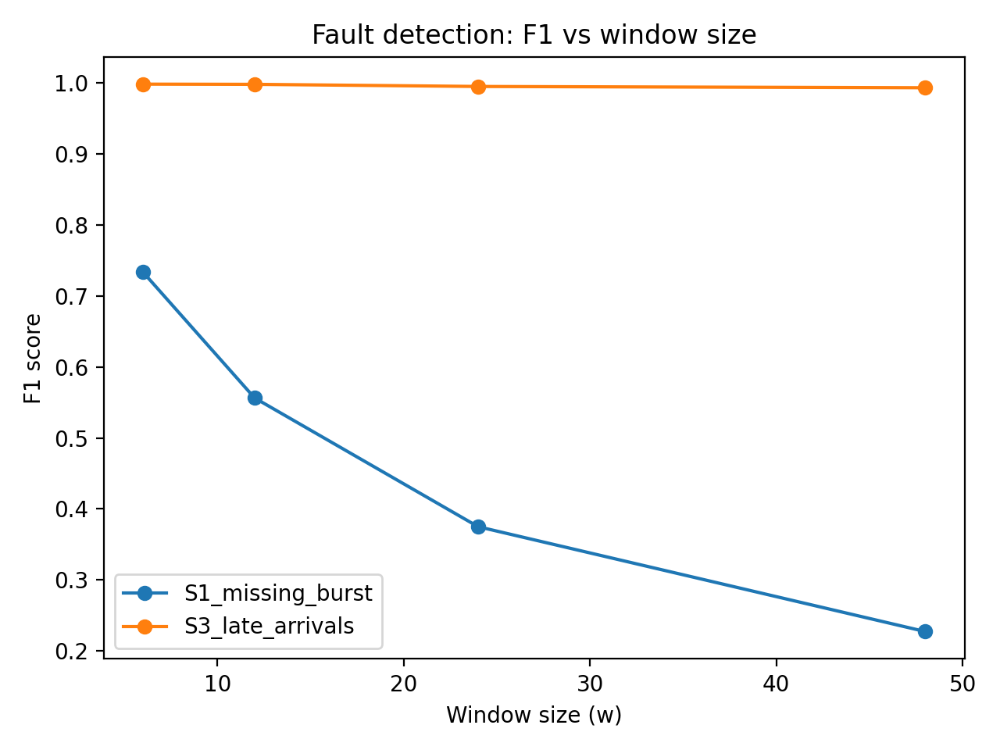
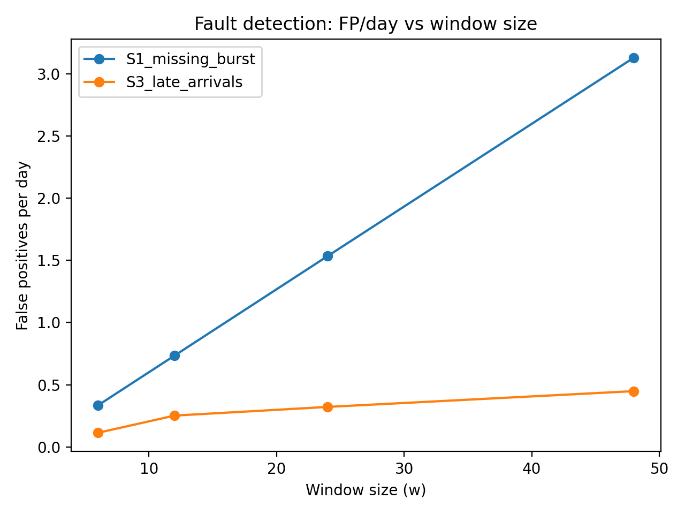
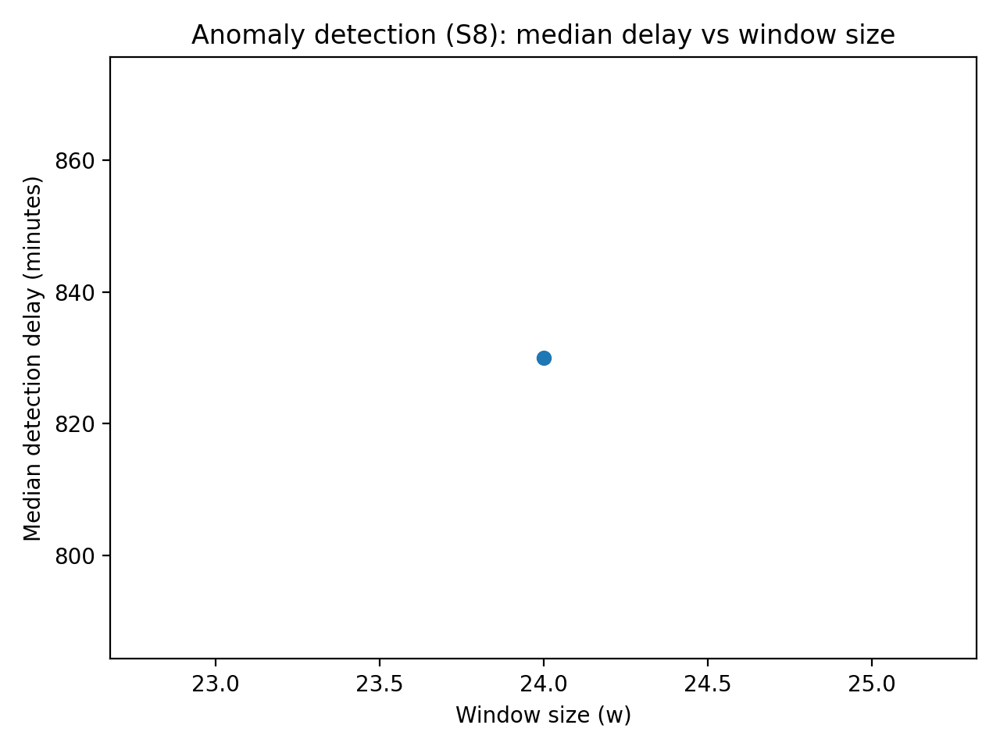
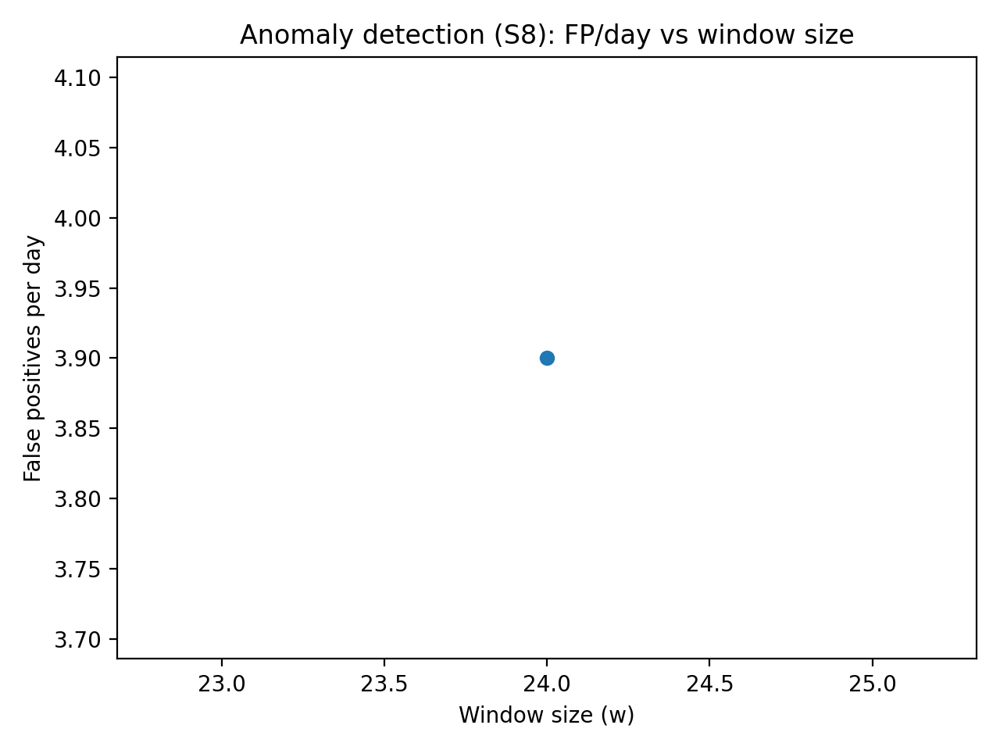

# Results

We report results for three injected scenarios using the time-grid edge evaluation:
(i) S1_missing_burst (data completeness faults),
(ii) S3_late_arrivals (ingestion lateness faults),
(iii) S8_efficiency_drop (gradual efficiency degradation, anomaly).

## Window-size effects on fault detection (S1, S3)

Figure 1 shows the F1 score versus window size (w) for the two fault scenarios. For both S1_missing_burst and S3_late_arrivals, smaller windows provide higher F1, indicating better sensitivity to faults under the fixed time-grid evaluation.

Figure 2 reports false positives per day as a function of w. Increasing w increases false positives for S1 (missing-burst), while S3 remains comparatively stable at low FP/day in the best range.

## Anomaly scenario (S8): delay and false positives

For S8_efficiency_drop, Figure 3 reports the detection delay trend across window sizes. The best empirical setting in our current experiment configuration is w=24, but the achieved precision/recall remains low, indicating that additional drift-specific logic (e.g., CUSUM or change-point detection) is required to reliably detect gradual efficiency degradation under our label definition.

Figure 4 reports false positives per day for the anomaly case. The observed FP/day highlights the need for tighter anomaly criteria and/or label-aligned scoring for gradual shifts.

